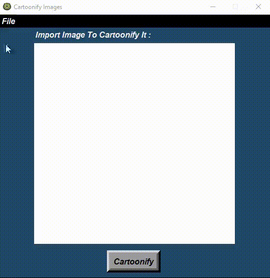
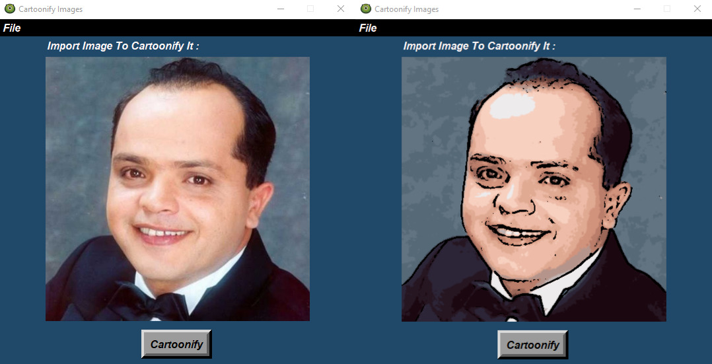
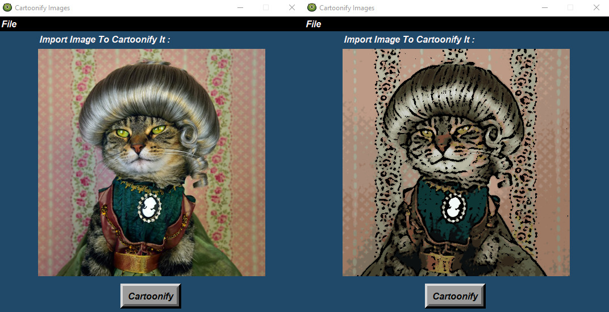

# Cartoonify-the-image
## Table of contents:

- [Introduction](#introduction)
- [Project Features](#project-features)
- [Project Full Demo](#project-full-demo)
- [Before And After](#before-and-after)
- [Project Structure](#project-structure)
- [Run The Project](#run-the-project)


### Introduction
##### •	It’s an Image processing project which is a GUI based project to upload any image and make it a cartoon that it's based on gaussian blur and edge detection techniques and you can save the cartoonified image where you want.

<p align="center">
    
</p>


### Project Features

In this application you can:

> 1. Upload your photo from your PC.

<p align="center">
  
</p>
<br>

> 2. Cartoonified image that you uploaded.

<p align="center">
 
</p>
<br>

> 3. Save the cartoonified image where you want in your PC.

<p align="center">
  
</p>
<br>

> 4. Exit application.
<p align="center">
  
</p>
<br>

### Project Full Demo
<p align="center">
  
</p>

### Before And After
<p align="center">
  
</p>
<p align="center">
  
</p>

### Project Structure
The Desktop Application is built using:

<table align="center">
  <tr>
    <td align="center" width="150">
      <a href="https://www.python.org" target="_blank"></a>
      <br>Python
    </td>
      <td align="center" width="150">
      <a href="https://opencv.org/" target="_blank">  </a> 
     <br>Opencv
    </td>
      <td align="center" width="150">
      <a href="https://www.pysimplegui.org/en/latest/" target="_blank"></a>
      <br>PySimpleGUI
    </td>
   </tr>
</table>

```
main
├─ Cartoonify the image
│  ├─ Cartoonify with GUI
│  |  ├─ cartoonify.py
|  |  ├─ image.py
|  |  └─ index.py
│  └─ Notebook Code 
├─ Screenshots
└─ README.md
```

### Run The Project
1. Install Python3 in your computer

```
Download it from www.python.org/downloads/
```

2. Install the following packages
```
pip install numpy
```
```
pip install PySimpleGUI
```
```
pip install opencv-python
```
```
pip install Pillow
```
```
pip install pathlib
```
```
pip install temp
```
```
pip install scikit-image
```
```
pip install requires.io
```
```
pip install image
```
```
pip install bytesbufio
```

3. Open Project Terminal & Run
