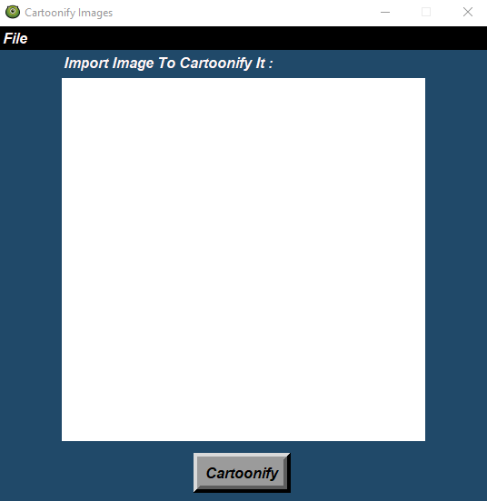
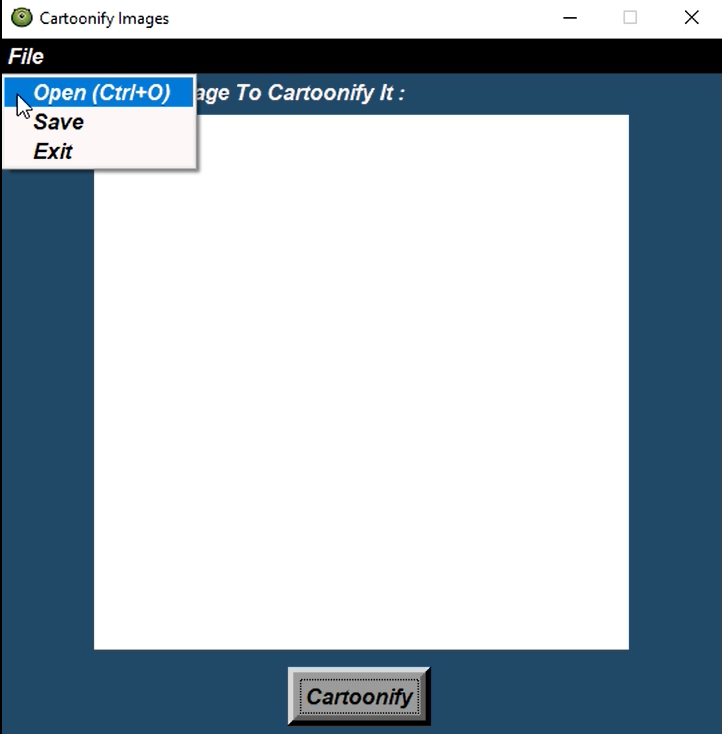
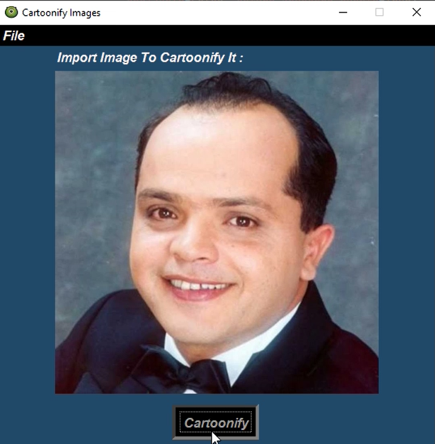
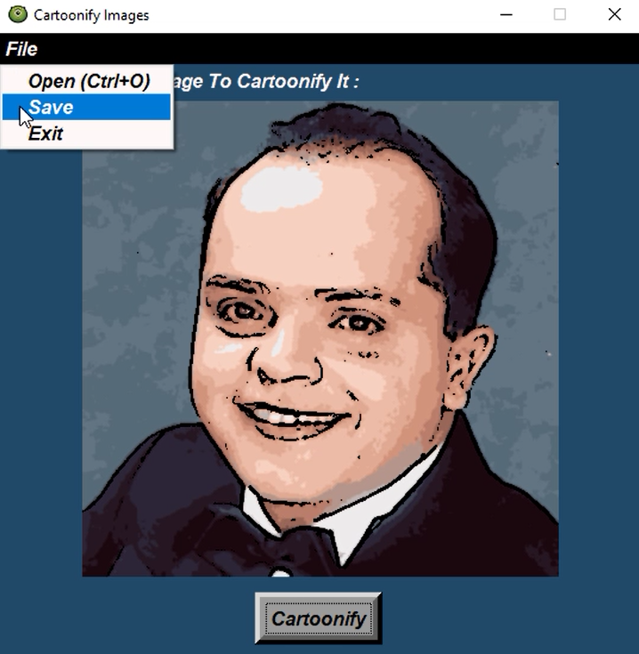
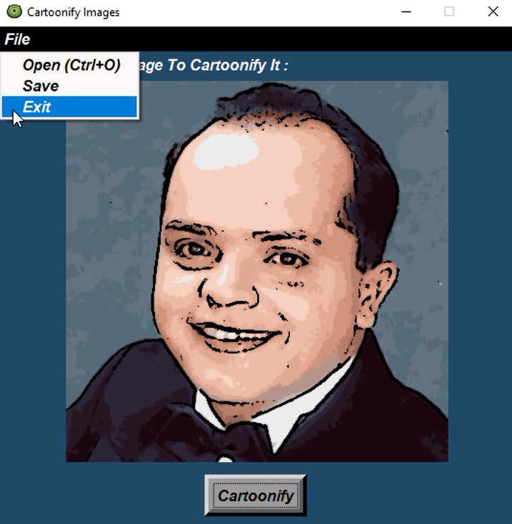

# Cartoonify-the-image
## Table of contents:

- [Introduction](#introduction)
- [Project Features](#project-features)
- [Project full Demo](#project-full-demo)

### Introduction
#### •	It’s an Image processing project which is a GUI based project to upload any image and make it a cartoon that it's based on gaussian blur and edge detection techniques and you can save the cartoonified image where you want.

    

### Project Features

In this application you can:

> 1. Upload your photo from your PC.

  

 

> 2. Cartoonified image that you uploaded.

 

 

> 3. Save the cartoonified image where you want in your PC.

  

 

> 4. Exit application.

  

 

### Project full Demo

  

